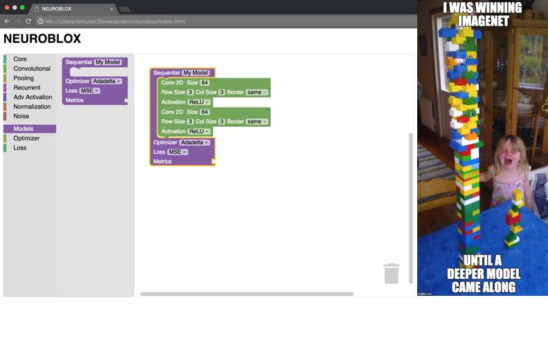

# neuroblox

A simple to use, scratch-style, drag-and-drop workflow for quickly building
Deep Learning models with Keras. Currently a proof-of-concept electron application.

Still needs improvement and better interface polishing before implementing a Keras
run-time execution with the interface.

To build, clone this repo and run: `npm install && npm start`

#### License [The MIT License](LICENSE.md)
